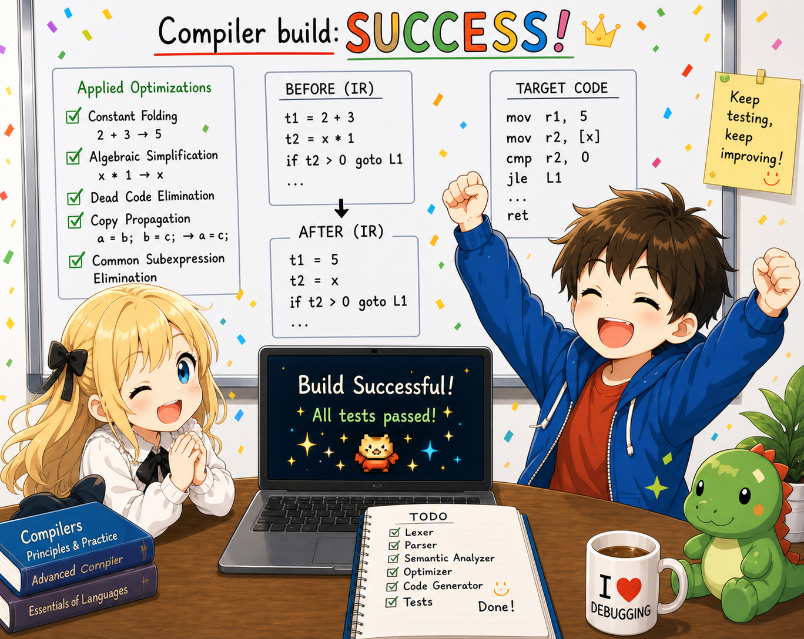

# tiny-c — Build Your Own C Compiler in 1500 Lines of C

**English** | [日本語](README-jp.md)

**tiny-c** is a teaching **C compiler** that compiles a tiny subset of C to **x86-64 assembly**. The compiler source is about **1500 lines of C**. The documentation is written so that knowledge of C alone is enough to follow along — reading the seven chapters in order naturally walks you through every line of the codebase.

If you have ever wanted to **build your own C compiler from scratch**, understand how **lexers, parsers, and code generators** fit together, or see how a real compiler emits x86-64 assembly for variables, pointers, function calls, and recursion — this **compiler tutorial** is for you. Topics covered: **lexical analysis with flex**, **parsing with bison**, **abstract syntax tree (AST)** construction, **code generation**, **System V AMD64 ABI**, **lvalue/rvalue** handling, **stack frames**, **block scope**, **constant folding**, **peephole optimization**, and **backpatching**.

## What it does

```c
int fib(int n) {
    if (n <= 1) { return n; }
    return fib(n - 1) + fib(n - 2);
}

int main() {
    return fib(10);   // → 55
}
```

tiny-c compiles this to x86-64 assembly. Recursion, loops, pointers, arrays, and function calls all work.

## Documentation

The documentation **is the main artifact** of this project. Each chapter presents **a complete, working small compiler**; as chapters progress, the language grows and so does the compiler. Seven chapters total.

| Chapter | What it can compile | Focus |
|---|------|------|
| [Ch1: A compiler that just returns 42](docs/en/ch01/00_overview.md) | `int main() { return 42; }` | The full pipeline (lexer → parser → AST → codegen → build) as scaffolding |
| [Ch2: Build a calculator](docs/en/ch02/00_overview.md) | `return 2 + 3 * 4;` (precedence) | How grammar expresses precedence; using the stack for intermediate values |
| [Ch3: Variables](docs/en/ch03/00_overview.md) | `int x = 1; int y = 2; return x + y;` | Variables as addresses in the stack frame; the symbol table |
| [Ch4: Branches and loops](docs/en/ch04/00_overview.md) | `if/else`, `while`, comparison operators (factorial, etc.) | The CPU only knows conditional jumps; label generation |
| [Ch5: Calling and defining functions](docs/en/ch05/00_overview.md) | Function definitions, parameters, recursion, `printf` | System V AMD64 ABI; register passing; 16-byte stack alignment |
| [Ch6: Pointers and arrays](docs/en/ch06/00_overview.md) | `char *s = "hello"; printf("%s\n", s);` (pointers, arrays, globals) | The lvalue/rvalue duality; the `gen_addr` function; symmetry between `&` and `*` |
| [Ch7: Optimization, backpatching, scope](docs/en/ch07/00_overview.md) | `{ int x=1; }{ int x=2; }` (block scope) | AST optimization (constant folding + algebraic simplification); backpatching eliminates Phase 1 so codegen is single-pass; block scope on top (`locals` head save/restore with slot reuse); peephole optimization |

Each chapter lives under `docs/en/chNN/`, starting with `00_overview.md` followed by `01_*.md`, `02_*.md`, etc. The corresponding source for each chapter is under `steps/chNN/`, kept as a minimal, buildable snapshot. The final form of tiny-c lives at **`steps/ch07/src/`** — the top-level `Makefile` builds it directly.

## Build & run

Prerequisites: gcc, flex, bison, make

```bash
make                          # build
./tinyc hello.c               # write assembly to stdout
./tinyc --dump-ast hello.c    # print the AST instead

# Produce an executable (x86-64 Linux)
./tinyc hello.c > hello.s
gcc -o hello hello.s
./hello
```

## Tests

```bash
make test
```

Each `test/cases/*.c` file is fed to `./tinyc`, which emits assembly. The expected exit code and stdout are written as comments at the top of each test case: `// expect: <exit code>` and `// output: <stdout>`.

- **On x86-64 Linux**: the assembly is linked with `gcc`, the binary is run, and the exit code and stdout are compared to the expectations.
- **On other platforms** (Mac etc.): execution is skipped; only "did tinyc produce valid-looking assembly" is checked.

Test cases are organized by chapter prefix (`01_*.c` through `07_*.c`).

## Supported grammar

| Feature | Examples |
|------|-----|
| Types | `int`, `char`, `void`, `int*`, `char*` |
| Literals | `42`, `'a'`, `"hello"` |
| Operators | `+` `-` `*` `/` `%` `==` `!=` `<` `<=` `>` `>=` `!` `-` (unary) `&` `*` (dereference) |
| Control flow | `if`/`else`, `while` |
| Functions | Definition and call (up to 6 arguments) |
| Variables | Local (initializer required), global |
| Arrays | 1-D only (`int a[10];`) |
| Pointers | 1 level only (`int *p`) |

Deliberately excluded: `for`, `switch`, `&&`, `||`, structs, float, preprocessor, etc.


## Credits

- Concept: t-ishii66 (studied physics in college; systems engineer; struggling with conversational English)
- Structure: t-ishii66
- Coding: Claude Opus 4.7
- Documentation: Claude Opus 4.7
- Code review: t-ishii66
- Documentation review: t-ishii66
- Illustrations: ChatGPT 5.4
- Release date: 2026/5/11
- Version: 1.0.0
- Copyright (C) 2026 t-ishii66. All rights reserved.



