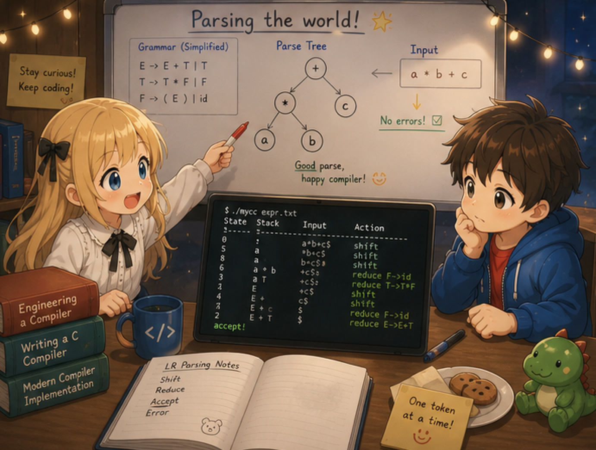

# 第2章 — 電卓を作る

## 0. はじめに

第1章で `int main() { return 42; }` が動くコンパイラができた。骨格は完成している。第2章では、この骨格に **算術** を足す。

この章のゴールはこう。

```c
int main() {
    return 2 + 3 * 4;
}
```

これを正しく `14` を返すコンパイラにする（`2 + (3*4) = 14` であり、`(2+3)*4 = 20` ではない）。

四則演算 (`+ - * / %`)、括弧、単項マイナス (`-x`) が使えるようになる。要するに、Cの式の中で **整数だけを使う電卓** を実現する。

```c
return (10 - 3) * 2 + 100 / 4 % 7;   // 動く
return -5 + 8;                        // 動く
return -(2 + 3);                      // 動く
```

## 1. ch01 との差分

足すものは多くない。

| ファイル | 変更 |
|---------|------|
| `lexer.l` | `+ - * / %` のトークン5つを追加 |
| `parser.y` | 式の文法を **優先順位を表す階層** に書き直す |
| `ast.h` / `ast.c` | `NODE_BINARY`, `NODE_UNARY` の2つを追加 |
| `codegen.c` | 二項演算と単項演算の生成を追加。スタックを使った中間値の管理が登場 |
| `main.c` / `Makefile` | **変更なし** |

新しい中心テーマは2つ。

- **文法が優先順位を表現する仕組み** — `parser.y` をどう書けば `2 + 3 * 4` が正しく `2 + (3 * 4)` と解釈されるか。
- **スタックを使った中間値の管理** — レジスタは `%eax` しか使っていないのに、なぜ複雑な式が計算できるのか。

## 2. まず動かしてみる

**この章で作成する `tinyc`** に `.c` ファイルを渡すとアセンブリが出る。

```bash
$ cat test.c
int main() {
    return 2 + 3 * 4;
}

$ ./tinyc test.c
  .text
  .globl main
main:
  pushq %rbp
  movq %rsp, %rbp
  movl $4, %eax
  pushq %rax
  movl $3, %eax
  popq %rcx
  imull %ecx, %eax
  pushq %rax
  movl $2, %eax
  popq %rcx
  addl %ecx, %eax
  leave
  ret
```

`pushq` `popq` `imull` `addl` を含む11行。これが「式を評価するアセンブリ」の典型形だ。

実行ファイルに変換して動かせば、終了コードが14になる。

```bash
$ ./tinyc test.c > test.s
$ gcc -o test test.s
$ ./test ; echo $?
14
```

`--dump-ast` で AST を覗くと、優先順位が木の形に焼き付いていることがよく分かる。

```bash
$ ./tinyc --dump-ast test.c
FUNC_DEF main
  BLOCK
    RETURN
      BINARY +
        INT_LIT 2
        BINARY *
          INT_LIT 3
          INT_LIT 4
```

`+` のノードの右の子が `*` のノードになっている。「最初に `3*4` を計算し、その結果を `2` に足す」という構造が木の形で表現されている。

## 3. 節の構成

| 節 | 内容 |
|--------|------|
| 00（この文書）| 章の見取り図 |
| 01 | 文法による優先順位の表現 — parser.y の階層構造 |
| 02 | スタックで中間値を管理する — codegen.c の二項演算 |
| 03 | 全ファイルの完全形と差分、ビルドして動かす |

ch01 と違って flex、bison、AST、x86 の基礎は再説明しない。ch01 の道具をそのまま使う。

## 4. 次へ

次の節（`01_precedence.md`）では、`2 + 3 * 4` がなぜ `2 + (3*4)` になるのか、その仕組みを文法のレベルで見る。
