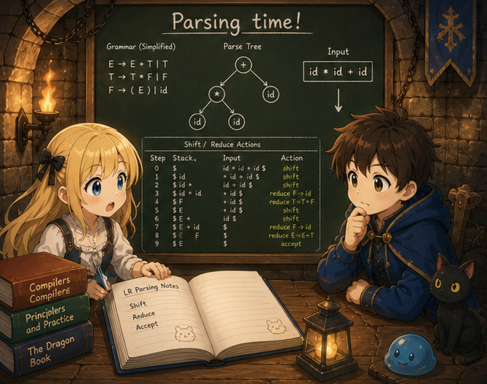

# 第3章 — 変数

## 0. はじめに

第3章では **変数** を導入する。

```c
int main() {
    int x = 1;
    int y = 2;
    return x + y;
}
```

`x`、`y` という名前で値に紐づけ、後でその名前で取り出せる。代入もできるようになる。

```c
int main() {
    int x = 10;
    x = x + 5;
    return x;        // 15
}
```

## 1. ch02 との差分

| ファイル | 変更 |
|---------|------|
| `lexer.l` | `=` トークン追加（1行） |
| `parser.y` | `var_decl`, `expr_stmt`, `assign`, `IDENT` を expr に追加 |
| `ast.h` / `ast.c` | `NODE_IDENT`, `NODE_ASSIGN`, `NODE_VAR_DECL`, `NODE_EXPR_STMT` を追加 |
| `codegen.c` | **シンボルテーブル**（名前 → スタックオフセット）を導入。新ノード4つの生成を追加 |
| `main.c` / `Makefile` | 変更なし |

新しい中心テーマは **「名前をスタック上のアドレスに変換する」** ── これだけ。

変数は実際にはメモリ上の場所だ。`x` という名前は人間のためのラベルで、CPU が見るのはアドレスだけ。コンパイラの仕事は、**名前 → アドレス** の変換表（シンボルテーブル）を作ることだ。

## 2. まず動かしてみる

```bash
$ cat test.c
int main() {
    int x = 1;
    int y = 2;
    return x + y;
}

$ ./tinyc --dump-ast test.c
FUNC_DEF main
  BLOCK
    VAR_DECL x
      INT_LIT 1
    VAR_DECL y
      INT_LIT 2
    RETURN
      BINARY +
        IDENT x
        IDENT y
```

3つの statement が順に並ぶ AST。`VAR_DECL` ノードは「変数を作る」、`IDENT` ノードは「変数を読む」。

```bash
$ ./tinyc test.c
  .text
  .globl main
main:
  pushq %rbp
  movq %rsp, %rbp
  subq $8, %rsp                  # x のための領域
  movl $1, %eax
  movl %eax, -8(%rbp)            # x = 1
  subq $8, %rsp                  # y のための領域
  movl $2, %eax
  movl %eax, -16(%rbp)           # y = 2
  movl -16(%rbp), %eax           # eax = y
  pushq %rax
  movl -8(%rbp), %eax            # eax = x
  popq %rcx
  addl %ecx, %eax                # eax = x + y
  leave
  ret

$ ./tinyc test.c > test.s && gcc -o test test.s && ./test; echo $?
3
```

`-8(%rbp)`、`-16(%rbp)` は「`%rbp` から見て -8 バイトの場所」「-16 バイトの場所」── **スタック上の番地** を指す。スタック上にこんな配置が出来上がっている:

```
            ↑ 高アドレス
   ┌──────────────────────┐
   │  呼び出し元の戻り番地  │  +8(%rbp)
   ├──────────────────────┤
   │  保存された呼び出し元の %rbp │  0(%rbp)  ← %rbp はここを指す
   ├──────────────────────┤
   │  x = 1               │  -8(%rbp)   ← 1 番目の subq $8 で確保
   ├──────────────────────┤
   │  y = 2               │  -16(%rbp)  ← %rsp はここ（2 番目の subq $8 で確保）
   ├──────────────────────┤
   │  （空き）              │
   ↓ 低アドレス
```

x86-64 のスタックは **下方向（低アドレス側）に伸びる**。`subq $8, %rsp` でその空き領域を1つずつ確保し、`-8(%rbp)`、`-16(%rbp)` という固定の番地として変数を割り当てる。番地と名前のマッピングをコンパイラがどう作るかが、この章の中身だ。

## 3. 節の構成

| 節 | 内容 |
|--------|------|
| 00（この文書）| 章の見取り図 |
| 01 | 文法の追加分 — `var_decl`、`assign`、`IDENT` を式に |
| 02 | スタックフレームとシンボルテーブル — 名前をオフセットに変える |
| 03 | 全ファイルの完全形と差分、ビルドして動かす |

## 4. 次へ

節 01（`01_grammar.md`）では `int x = expr;` の文、代入式、識別子の式利用を見る。
