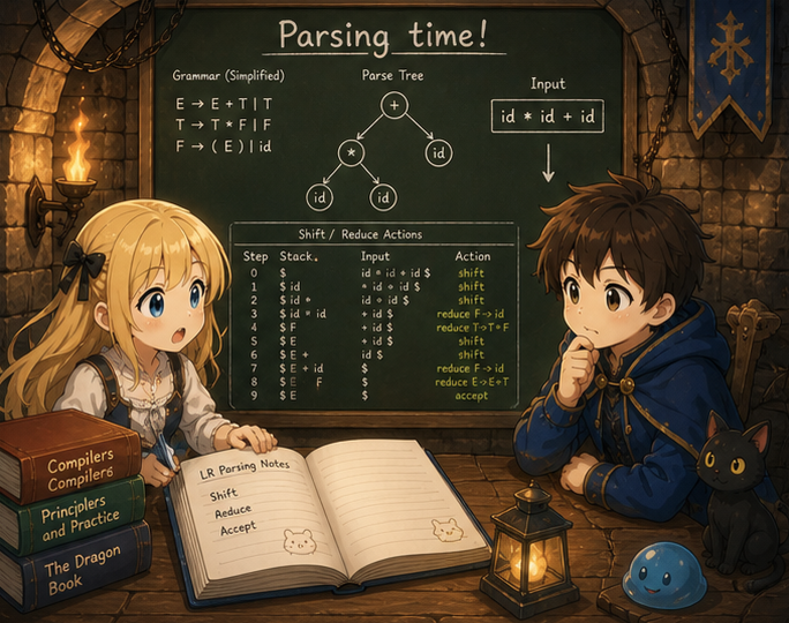

# Chapter 3 — Variables

## 0. Introduction

Chapter 3 introduces **variables**.

```c
int main() {
    int x = 1;
    int y = 2;
    return x + y;
}
```

We bind values to names like `x` and `y`, and later read them back by name. Assignment becomes possible too.

```c
int main() {
    int x = 10;
    x = x + 5;
    return x;        // 15
}
```

## 1. Diff against ch02

| File | Change |
|---------|------|
| `lexer.l` | Add the `=` token (one line) |
| `parser.y` | Add `var_decl`, `expr_stmt`, `assign`, and `IDENT` (in expressions) |
| `ast.h` / `ast.c` | Add `NODE_IDENT`, `NODE_ASSIGN`, `NODE_VAR_DECL`, `NODE_EXPR_STMT` |
| `codegen.c` | Introduce a **symbol table** (name → stack offset). Generate code for the four new node kinds |
| `main.c` / `Makefile` | No change |

The central new theme: **"convert names into addresses on the stack."** That's it.

A variable is actually a location in memory. The name `x` is a label for humans; what the CPU sees is just an address. The compiler's job is to build a translation table (the symbol table) from **name → address**.

## 2. Run it first

```bash
$ cat test.c
int main() {
    int x = 1;
    int y = 2;
    return x + y;
}

$ ./tinyc --dump-ast test.c
FUNC_DEF main
  BLOCK
    VAR_DECL x
      INT_LIT 1
    VAR_DECL y
      INT_LIT 2
    RETURN
      BINARY +
        IDENT x
        IDENT y
```

The AST lays out three statements in order. `VAR_DECL` nodes "create variables"; `IDENT` nodes "read variables."

```bash
$ ./tinyc test.c
  .text
  .globl main
main:
  pushq %rbp
  movq %rsp, %rbp
  subq $8, %rsp                  # space for x
  movl $1, %eax
  movl %eax, -8(%rbp)            # x = 1
  subq $8, %rsp                  # space for y
  movl $2, %eax
  movl %eax, -16(%rbp)           # y = 2
  movl -16(%rbp), %eax           # eax = y
  pushq %rax
  movl -8(%rbp), %eax            # eax = x
  popq %rcx
  addl %ecx, %eax                # eax = x + y
  leave
  ret

$ ./tinyc test.c > test.s && gcc -o test test.s && ./test; echo $?
3
```

`-8(%rbp)` and `-16(%rbp)` mean "the location 8 (or 16) bytes below `%rbp`" — they're **addresses on the stack**. The layout in memory looks like:

```
            ↑ high address
   ┌──────────────────────────┐
   │  caller's return address │  +8(%rbp)
   ├──────────────────────────┤
   │  saved caller's %rbp     │  0(%rbp)  ← %rbp points here
   ├──────────────────────────┤
   │  x = 1                   │  -8(%rbp)   ← reserved by the first subq $8
   ├──────────────────────────┤
   │  y = 2                   │  -16(%rbp)  ← %rsp is here (reserved by the second subq $8)
   ├──────────────────────────┤
   │  (free)                  │
   ↓ low address
```

The x86-64 stack **grows downward (toward lower addresses)**. Each `subq $8, %rsp` reserves one slot of space, and we hand out the resulting fixed addresses (`-8(%rbp)`, `-16(%rbp)`) to variables. How the compiler builds the mapping between addresses and names is what this chapter is about.

## 3. Section layout

| Section | Contents |
|--------|------|
| 00 (this file) | Map of the chapter |
| 01 | Grammar additions — `var_decl`, `assign`, `IDENT` in expressions |
| 02 | Stack frame and symbol table — turning names into offsets |
| 03 | Complete files with diffs; build and run |

## 4. Next

In section 01 (`01_grammar.md`) we look at the `int x = expr;` statement, assignment expressions, and using identifiers as expressions.
