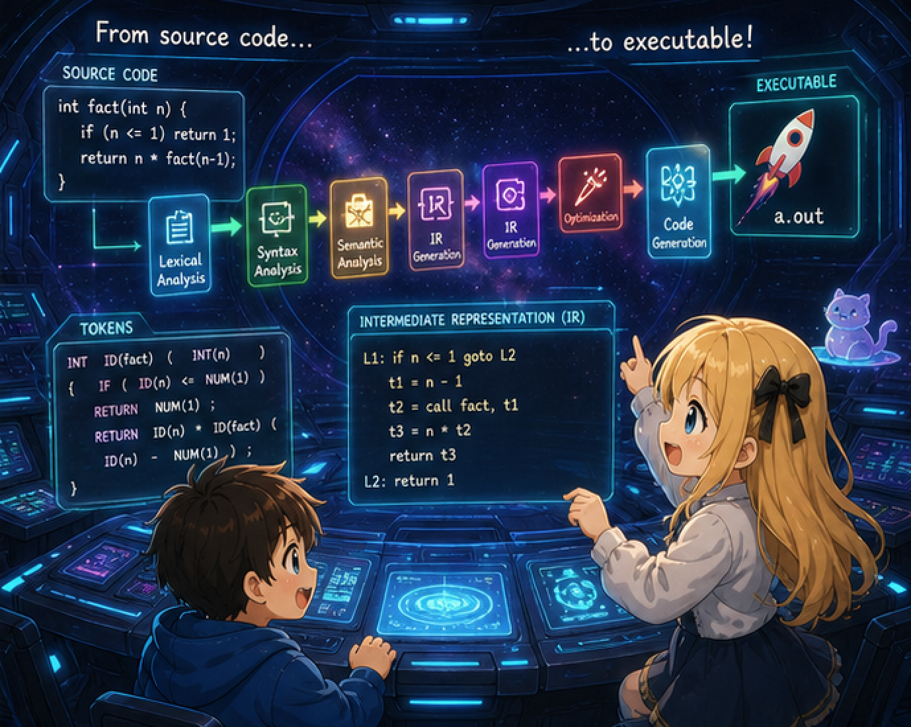

# Chapter 4 — Branches and loops

## 0. Introduction

Chapter 4 introduces **`if/else`** and **`while`**. With these, we can write things that deserve to be called "algorithms." For example, code that computes `5! = 120`:

```c
int main() {
    int n = 5;
    int result = 1;
    while (n > 1) {
        result = result * n;
        n = n - 1;
    }
    return result;
}
```

Branching with `if`:

```c
int main() {
    int x = 10;
    if (x == 10) {
        return 100;
    } else {
        return 0;
    }
}
```

## 1. Diff against ch03

| File | Change |
|---------|------|
| `lexer.l` | Add keywords `if`, `else`, `while`; comparison operators `< <= > >= == !=`; and `!` |
| `parser.y` | Add `if`, `while`, and block statements to `stmt`. Add `equality` and `relational` to expressions. Resolve the dangling-else with `%expect 1` |
| `ast.h` / `ast.c` | Add `NODE_IF` and `NODE_WHILE`. Change `op` from `char` to `int`, and define `OP_LE`, `OP_GE`, `OP_EQ`, `OP_NE` |
| `codegen.c` | Introduce **label generation** and **conditional jumps**. Comparisons become `cmpl` + `setcc`. Same idea for `!` |
| `main.c` / `Makefile` | No change |

The central new theme: **the CPU only knows conditional jumps**.

`if` and `while` both, at the CPU level, are nothing more than "compute a condition, then jump somewhere depending on the result." The compiler's job is to translate the high-level structure of the source into combinations of jumps and labels.

## 2. Run it first

```bash
$ cat test.c
int main() {
    int n = 5;
    int result = 1;
    while (n > 1) {
        result = result * n;
        n = n - 1;
    }
    return result;
}

$ ./tinyc test.c > test.s && gcc -o test test.s && ./test; echo $?
120
```

`5! = 120` works.

With `--dump-ast` you can see the structure of `while` and `if`.

```bash
$ ./tinyc --dump-ast test.c
FUNC_DEF main
  BLOCK
    VAR_DECL n
      INT_LIT 5
    VAR_DECL result
      INT_LIT 1
    WHILE
      BINARY >
        IDENT n
        INT_LIT 1
      BLOCK
        EXPR_STMT
          ASSIGN
            IDENT result
            BINARY *
              IDENT result
              IDENT n
        EXPR_STMT
          ASSIGN
            IDENT n
            BINARY -
              IDENT n
              INT_LIT 1
    RETURN
      IDENT result
```

The `WHILE` node has two children: condition and body. The AST's nesting structure mirrors the "nesting of control." In the generated assembly, labels (like `.Lbegin_0`, `.Lendwhile_0`) and conditional jumps (`je`) make their first appearance.

## 3. Section layout

| Section | Contents |
|--------|------|
| 00 (this file) | Map of the chapter |
| 01 | Grammar additions — comparison-operator hierarchy, if/while/block statements, dangling-else |
| 02 | Codegen for comparison and logical negation — `cmpl` + `setcc` |
| 03 | Codegen for if and while — labels and conditional jumps |
| 04 | Complete files with diffs; build and run |

## 4. Next

In section 01 (`01_grammar.md`) we look at the comparison-operator hierarchy, the `if`/`while`/`{ ... }` statements, and dealing with the dangling-else.
