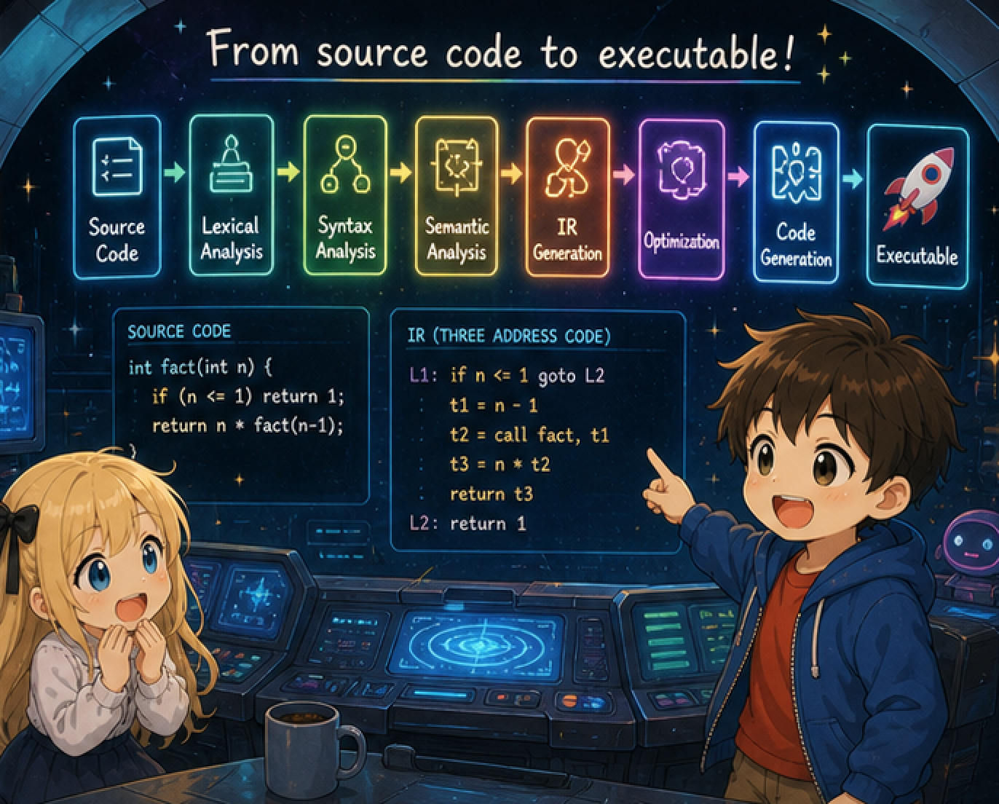

# Chapter 5 — Calling and defining functions

## 0. Introduction

Chapter 5 introduces **multiple functions**, parameters, function calls, and **recursion**.

```c
int fact(int n) {
    if (n <= 1) return 1;
    return n * fact(n - 1);
}

int main() {
    return fact(5);     // 120
}
```

`fact` calls itself — that's recursion. As long as the prologue/epilogue and stack frame work correctly, recursion **just works**.

## 1. Diff against ch04

| File | Change |
|---------|------|
| `lexer.l` | Add `,` (for argument lists) |
| `parser.y` | A program becomes a list of function definitions. Parameterized definitions; function-call expressions |
| `ast.h` / `ast.c` | Add `NODE_PROGRAM`, `NODE_CALL`, and the `params`/`args` fields |
| `codegen.c` | Register-passing per the **System V AMD64 ABI**, **16-byte stack alignment**, and a pre-pass that reserves local space up front |
| `main.c` / `Makefile` | No change |

Two central themes for the chapter:

- **The calling convention as a "contract"** — how the caller and callee agree on register usage.
- **Why recursion "just works"** — given a correctly functioning prologue/epilogue and stack frame, a function calling itself is no special case.

## 2. Run it first

### A function with parameters

```bash
$ cat test.c
int add(int a, int b) {
    return a + b;
}
int main() {
    return add(3, 4);
}

$ ./tinyc test.c > test.s && gcc -o test test.s && ./test; echo $?
7
```

### Recursion: factorial

```bash
$ cat test.c
int fact(int n) {
    if (n <= 1) return 1;
    return n * fact(n - 1);
}
int main() {
    return fact(5);
}

$ ./tinyc test.c > test.s && gcc -o test test.s && ./test; echo $?
120
```

### Mutual recursion

```bash
$ cat test.c
int is_even(int n) {
    if (n == 0) return 1;
    return is_odd(n - 1);
}
int is_odd(int n) {
    if (n == 0) return 0;
    return is_even(n - 1);
}
int main() {
    return is_even(10);  // 1
}
```

`is_even` calls `is_odd`, and `is_odd` calls `is_even`. tiny-c doesn't require declarations (prototypes), so even forward references work (more on this later).

## 3. New AST shapes

Input:

```c
int add(int a, int b) { return a + b; }
int main() { return add(3, 4); }
```

AST:

```
PROGRAM                      ← new; list of function definitions
  FUNC_DEF add
    PARAM a                  ← new; parameter name
    PARAM b
    BLOCK
      RETURN
        BINARY +
          IDENT a
          IDENT b
  FUNC_DEF main
    BLOCK
      RETURN
        CALL add             ← new; function call
          INT_LIT 3
          INT_LIT 4
```

Where ch04 had `Node *program = func_def` (a single function), now a `PROGRAM` node holds multiple functions. The `CALL` node carries a function name and an argument list.

## 4. Section layout

| Section | Contents |
|--------|------|
| 00 (this file) | Map of the chapter |
| 01 | Grammar and AST additions — multiple functions, parameters, function calls |
| 02 | The System V AMD64 ABI — argument registers, return value, save conventions, 16-byte alignment |
| 03 | Redesigning the stack frame — pre-pass reservation, parameter spill |
| 04 | Codegen for function calls — set up arguments, keep alignment, and `call` |
| 05 | Complete files with diffs; build and run recursion |

## 5. Next

In section 01 (`01_grammar.md`) we look at the grammar for multiple functions, argument lists, and function-call expressions.
