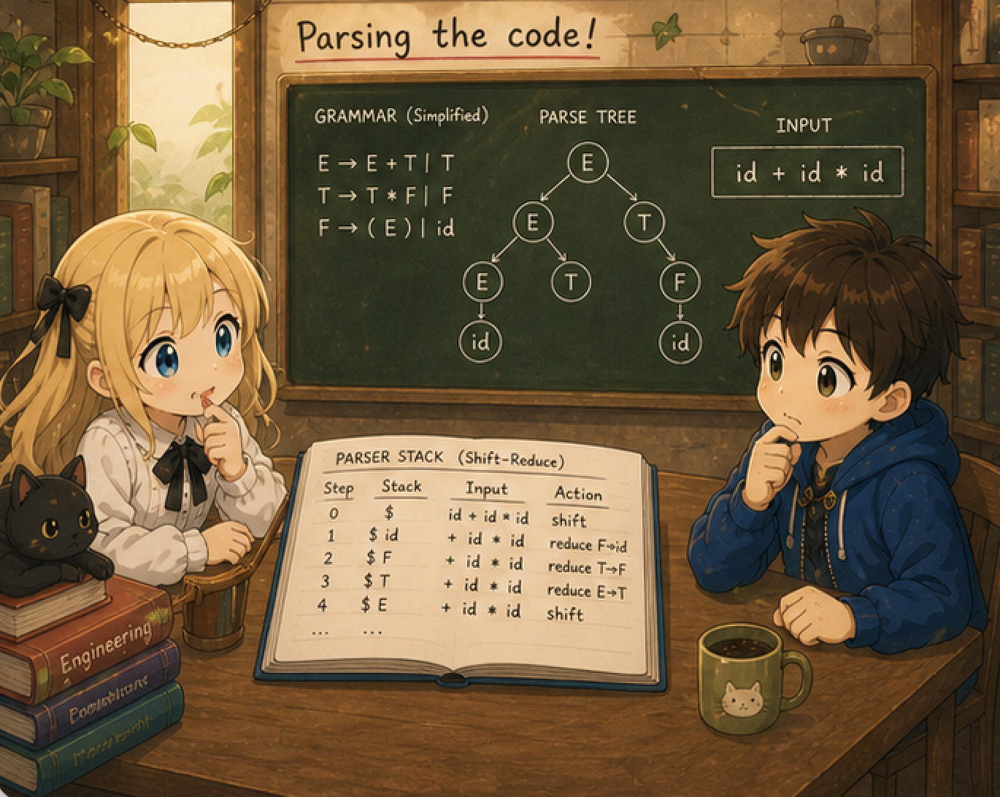

# Chapter 6 — Pointers and arrays

## 0. Introduction

Chapter 6 introduces **pointers**, **arrays**, **string literals**, and **global variables**. With these, tiny-c becomes a language that can write "Hello, world" via `printf`.

```c
int main() {
    char *s = "hello";
    printf("%s\n", s);
    return 0;
}
```

`*p` and `&x`, `a[i]`, `'a'`, `"hello"`, `int g;` — by this point, a substantial portion of familiar C works.

## 1. Diff against ch05

| File | Change |
|---------|------|
| `lexer.l` | Add `&`, `[`, `]`; keywords `char`, `void`; character literals `'...'`; string literals `"..."` |
| `parser.y` | A `type` rule (`int`, `char`, `int*`, `char*`, `void`); global variable declarations at the top level; subscript `a[i]`; unary `&` and `*`; char/string literals |
| `ast.h` / `ast.c` | A `Type` struct; `NODE_CHAR_LIT`, `NODE_STRING_LIT`, `NODE_GLOBAL_VAR_DECL`, `NODE_INDEX`; constructors expanded |
| `codegen.c` | **Introduce the `gen_addr` function**; the symbol table carries `Type`; emit globals to `.bss`; emit string literals to `.rodata`; size-aware load/store with `movb`/`movsbl`/`movq` |
| `main.c` / `Makefile` | No change |

The central new theme: **the duality of lvalue and rvalue**.

Every expression in C is classified as either an **lvalue** or an **rvalue**:

- **lvalue** — an expression that denotes **a location in memory**. It has an address; it can be written to. Examples: `x`, `*p`, `a[i]`, `g` (global).
- **rvalue** — an expression that denotes **a value**. No address; read-only. Examples: `42`, `x + 1`, `f()`, `'a'`.

The names come historically from "what can go on the left of `=` vs. only on the right," but the modern essence is **"does it have an address?"** Examples:

```c
x = 5;          /* x is an lvalue (write destination); 5 is an rvalue */
y = x + 1;      /* y is an lvalue; x appears in an rvalue context */
*p = 10;        /* *p is an lvalue (the location p points to) */
int *p = &x;   /* &x turns x's lvalue into an rvalue (the address), assigned to p */
&(x + 1);       /* error: x + 1 is an rvalue, can't take its address */
42 = x;         /* error: 42 is an rvalue, can't be a write destination */
```

The same `x` is an lvalue in `x = 5;` (write destination) and an rvalue in `y = x + 1;` (a value to read) — **its treatment depends on context**.

So ch06 splits codegen into two functions:

- **`gen_expr`** — compute the rvalue (place the value in `%eax`/`%rax`). Same as through ch05.
- **`gen_addr`** — compute the address of an lvalue (place the address in `%rax`). New in ch06.

The pointer operators `&` and `*` move back and forth between lvalue and rvalue:

- `&x` — take x's lvalue (its address) and produce it as an rvalue (a value) → call `gen_addr(x)`
- `*p` — the location p's rvalue (the address stored in p) points to → add a load from that address to produce the value

`&` removes one layer of "load"; `*` adds one — symmetric operations. This duality is the backbone of ch06's code generation.

## 2. Run it first

### Hello, world

```bash
$ cat hello.c
int main() {
    char *s = "hello";
    printf("%s\n", s);
    return 0;
}
$ ./tinyc hello.c > hello.s && gcc -o hello hello.s && ./hello
hello
```

### Modify a value through a pointer

```bash
$ cat ptr.c
int main() {
    int x = 5;
    int *p = &x;
    *p = 10;
    return x;       // 10
}
```

### Array

```bash
$ cat arr.c
int main() {
    int a[5];
    a[0] = 10;
    a[1] = 20;
    a[2] = 30;
    return a[0] + a[1] + a[2];   // 60
}
```

### Global variable

```bash
$ cat g.c
int g;

int set(int v) { g = v; return 0; }

int main() {
    set(42);
    return g;       // 42
}
```

### String handling (a hand-rolled strlen)

```bash
$ cat strlen.c
int strlen(char *s) {
    int n = 0;
    while (s[n] != 0) n = n + 1;
    return n;
}

int main() {
    char *s = "hello";
    return strlen(s);   // 5
}
```

`s[n]` reads one byte at a time at the char level (we handle the type-dependent pointer arithmetic internally).

## 3. The AST gets new shapes

Input:

```c
int main() {
    int x = 5;
    int *p = &x;
    *p = 10;
    return x;
}
```

AST:

```
PROGRAM
  FUNC_DEF main
    BLOCK
      VAR_DECL x : int
        INT_LIT 5
      VAR_DECL p : int*
        UNARY &
          IDENT x
      EXPR_STMT
        ASSIGN
          UNARY *
            IDENT p
          INT_LIT 10
      RETURN
        IDENT x
```

Nodes now carry `Type` information (`x : int`, `p : int*`). `UNARY &` and `UNARY *` are the AST representation of pointer operations. In the AST for `*p = 10`, a `UNARY *` sits on the left of `ASSIGN` — "`*p` as an lvalue."

## 4. Section layout

| Section | Contents |
|--------|------|
| 00 (this file) | Map of the chapter |
| 01 | Types and grammar additions — `Type` struct, `int*`/`char*` types, subscript `[]`, unary `&` and `*`, char/string literals, global declarations |
| 02 | lvalue and rvalue — the `gen_addr` function, the symmetry of `&` and `*`, array decay |
| 03 | Global variables and string literals — `.bss` and `.rodata`, size-aware load/store |
| 04 | Complete files with diffs; Hello, world demo |

## 5. Next

In section 01 (`01_types.md`) we introduce **the concept of type** into tiny-c. Every variable was implicitly `int` before; from ch06, we need to distinguish `char`, `int*`, `char*`, and `int[N]`. We look at the `Type` struct and the related grammar/AST changes.
