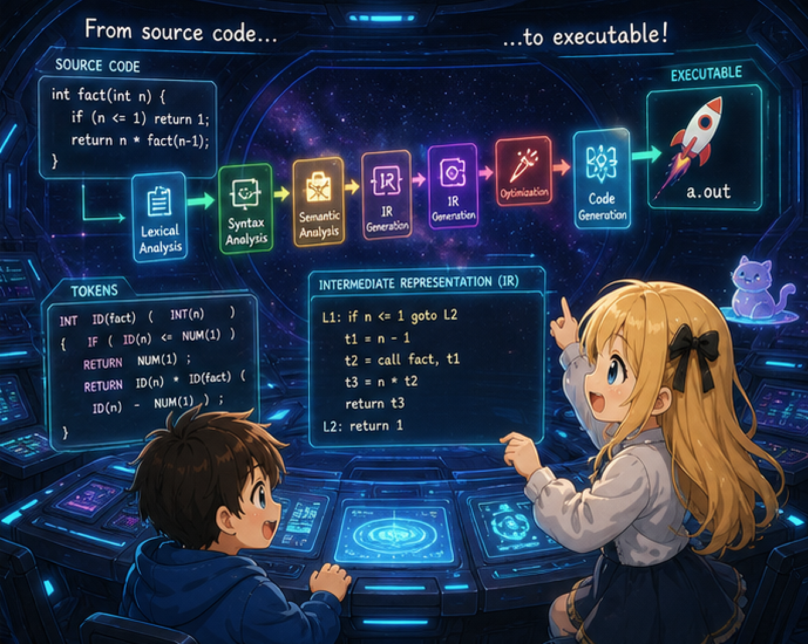

# 第4章 — 分岐とループ

## 0. はじめに

第4章で **`if/else`** と **`while`** を導入する。これで「アルゴリズム」と呼べるものが書けるようになる。たとえば `5! = 120` を計算するコード:

```c
int main() {
    int n = 5;
    int result = 1;
    while (n > 1) {
        result = result * n;
        n = n - 1;
    }
    return result;
}
```

`if` での分岐:

```c
int main() {
    int x = 10;
    if (x == 10) {
        return 100;
    } else {
        return 0;
    }
}
```

## 1. ch03 との差分

| ファイル | 変更 |
|---------|------|
| `lexer.l` | キーワード `if` `else` `while`、比較演算子 `< <= > >= == !=`、`!` を追加 |
| `parser.y` | `if`、`while`、ブロック文を stmt に追加。`equality`、`relational` を式に追加。dangling-else に `%expect 1` |
| `ast.h` / `ast.c` | `NODE_IF`、`NODE_WHILE` 追加。`op` を `char` から `int` に変更し、`OP_LE` `OP_GE` `OP_EQ` `OP_NE` を定義 |
| `codegen.c` | **ラベル生成**と**条件ジャンプ**を導入。比較演算は `cmpl` + `setcc`。`!` も同様 |
| `main.c` / `Makefile` | 変更なし |

新しい中心テーマ: **CPU は条件ジャンプしか知らない**。

`if` も `while` も、CPU レベルではすべて「条件を計算して、結果に応じて別の場所に飛ぶ」だけだ。コンパイラの仕事は、ソースコードの高レベルな構造を、ジャンプとラベルの組み合わせに翻訳することにある。

## 2. まず動かしてみる

```bash
$ cat test.c
int main() {
    int n = 5;
    int result = 1;
    while (n > 1) {
        result = result * n;
        n = n - 1;
    }
    return result;
}

$ ./tinyc test.c > test.s && gcc -o test test.s && ./test; echo $?
120
```

`5! = 120` の計算が動く。

`--dump-ast` で AST を覗くと、while・if の構造が見える。

```bash
$ ./tinyc --dump-ast test.c
FUNC_DEF main
  BLOCK
    VAR_DECL n
      INT_LIT 5
    VAR_DECL result
      INT_LIT 1
    WHILE
      BINARY >
        IDENT n
        INT_LIT 1
      BLOCK
        EXPR_STMT
          ASSIGN
            IDENT result
            BINARY *
              IDENT result
              IDENT n
        EXPR_STMT
          ASSIGN
            IDENT n
            BINARY -
              IDENT n
              INT_LIT 1
    RETURN
      IDENT result
```

`WHILE` ノードは「条件と本体」の2つの子を持つ。AST の階層がそのまま「制御の入れ子」を表している。生成アセンブリにはラベル（`.Lbegin_0` `.Lendwhile_0` のような）と条件ジャンプ（`je`）が登場する。

## 3. 節の構成

| 節 | 内容 |
|--------|------|
| 00（この文書）| 章の見取り図 |
| 01 | 文法の追加 — 比較演算子の階層、if/while/block の文、dangling-else |
| 02 | 比較演算と論理否定の codegen — `cmpl` + `setcc` |
| 03 | if と while の codegen — ラベルと条件ジャンプ |
| 04 | 全ファイルの完全形と差分、ビルドして動かす |

## 4. 次へ

節 01（`01_grammar.md`）では、比較演算子の階層、`if`・`while`・`{ ... }` の文、dangling-else への対処を見る。
