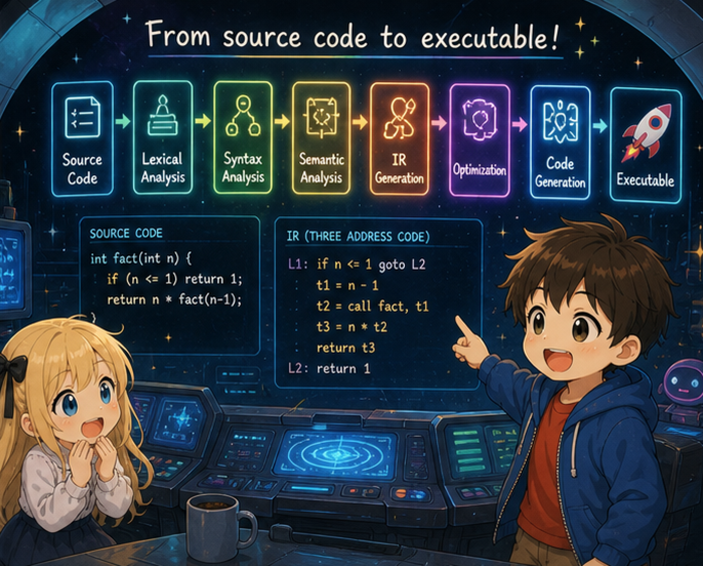

# 第5章 — 関数を呼ぶ・作る

## 0. はじめに

第5章で **複数の関数**、引数、関数呼び出し、そして **再帰** を扱う。

```c
int fact(int n) {
    if (n <= 1) return 1;
    return n * fact(n - 1);
}

int main() {
    return fact(5);     // 120
}
```

`fact` が自分自身を呼ぶ ── これが再帰。プロローグ・エピローグとスタックフレームが正しく機能していれば、再帰は **自然に動く**。

## 1. ch04 との差分

| ファイル | 変更 |
|---------|------|
| `lexer.l` | カンマ `,` を追加（引数リスト用） |
| `parser.y` | プログラムが複数の関数定義の列に。引数付き関数定義、関数呼び出し式 |
| `ast.h` / `ast.c` | `NODE_PROGRAM`、`NODE_CALL`、`params`/`args` フィールド追加 |
| `codegen.c` | **System V AMD64 ABI** に従ったレジスタ渡し、**16バイトアライメント**、ローカル領域の事前確保（pre-pass）に変更 |
| `main.c` / `Makefile` | 変更なし |

新しい中心テーマは2つ。

- **呼び出し規約 (calling convention) という「契約」** ── 呼び出す側と呼び出される側がレジスタの使い方をどう取り決めているか。
- **再帰がなぜ自然に動くか** ── プロローグ／エピローグとスタックフレームが正しく機能していれば、自分自身を呼んでも何も特別なことはない。

## 2. まず動かしてみる

### 引数付き関数

```bash
$ cat test.c
int add(int a, int b) {
    return a + b;
}
int main() {
    return add(3, 4);
}

$ ./tinyc test.c > test.s && gcc -o test test.s && ./test; echo $?
7
```

### 再帰: 階乗

```bash
$ cat test.c
int fact(int n) {
    if (n <= 1) return 1;
    return n * fact(n - 1);
}
int main() {
    return fact(5);
}

$ ./tinyc test.c > test.s && gcc -o test test.s && ./test; echo $?
120
```

### 相互再帰 (mutual recursion)

```bash
$ cat test.c
int is_even(int n) {
    if (n == 0) return 1;
    return is_odd(n - 1);
}
int is_odd(int n) {
    if (n == 0) return 0;
    return is_even(n - 1);
}
int main() {
    return is_even(10);  // 1
}
```

`is_even` が `is_odd` を、`is_odd` が `is_even` を呼ぶ。tiny-c では宣言 (prototype) を要求しないので、forward reference でも動く（後で詳しく）。

## 3. AST の新しい形

入力:

```c
int add(int a, int b) { return a + b; }
int main() { return add(3, 4); }
```

AST:

```
PROGRAM                      ← 新登場、関数定義のリスト
  FUNC_DEF add
    PARAM a                  ← 新登場、パラメータ名
    PARAM b
    BLOCK
      RETURN
        BINARY +
          IDENT a
          IDENT b
  FUNC_DEF main
    BLOCK
      RETURN
        CALL add             ← 新登場、関数呼び出し
          INT_LIT 3
          INT_LIT 4
```

これまでの `Node *program = func_def` から、`PROGRAM` ノードが複数の関数を抱える形に変わった。`CALL` ノードは関数名と引数リストを持つ。

## 4. 節の構成

| 節 | 内容 |
|--------|------|
| 00（この文書）| 章の見取り図 |
| 01 | 文法と AST の追加 — 複数関数、パラメータ、関数呼び出し |
| 02 | System V AMD64 ABI — 引数のレジスタ、戻り値、保存規則、16バイト整列 |
| 03 | スタックフレームの再設計 — 事前確保 (pre-pass)、パラメータの spill |
| 04 | 関数呼び出しの codegen — 引数を整え、アライメントを保ち、call する |
| 05 | 全ファイルの完全形と差分、ビルドして再帰を動かす |

## 5. 次へ

節 01（`01_grammar.md`）で、複数関数・引数リスト・関数呼び出し式の文法を見る。
