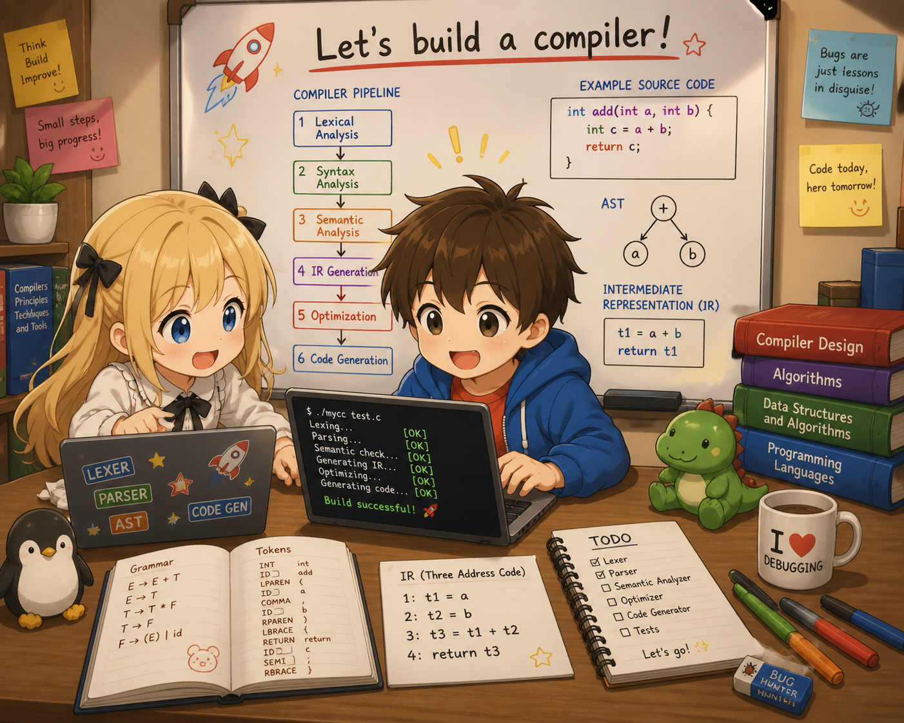

[English](../) &nbsp;|&nbsp; [日本語](./)

# tiny-c — 1500行で作る教育用Cコンパイラ



**tiny-c** は、C言語の小さなサブセットを x86-64 アセンブリにコンパイルする教育用 C コンパイラです。コンパイラ本体は **約 1500 行の C** で書かれており、ドキュメントは「C を知っていれば読める」ように書かれています。**7 つの章を順に読むだけで、1500 行のコードの全行を理解できる**構成です。

「**自分の手でCコンパイラを作ってみたい**」「**lexer / parser / codegen** がどう繋がっているのか知りたい」「変数・ポインタ・関数呼び出し・再帰が **x86-64 アセンブリ**にどう翻訳されるのか見たい」── そんな人のための教材です。

## tiny-c がコンパイルできる例

```c
int fib(int n) {
    if (n <= 1) { return n; }
    return fib(n - 1) + fib(n - 2);
}

int main() {
    return fib(10);   // → 55
}
```

再帰、ループ、ポインタ、配列、関数呼び出し、`printf`、ブロックスコープ ── すべて動きます。定数畳み込みとピープホール最適化で生成アセンブリも縮みます。

## 学べること

各章は **完全に動く小さなコンパイラ** を提示する構成。章が進むごとに言語機能が増え、コンパイラが育っていきます。

- **字句解析** ── **flex** による正規表現とトークン化
- **構文解析** ── **bison** の LALR(1) 文法、優先順位、結合性
- **抽象構文木（AST）** の構築と走査
- **コード生成** ── x86-64 アセンブリ (AT&T 構文)
- **スタックフレーム**、`%rbp` / `%rsp`、16 バイトアライメント
- **System V AMD64 ABI** ── レジスタ引数渡し (`%rdi`, `%rsi`, `%rdx`, `%rcx`, `%r8`, `%r9`)、可変長引数、`printf` 呼び出し
- **lvalue / rvalue** の二面性、`&` と `*` の対称性
- **ポインタ演算**、1次元配列、配列の decay
- `.bss` の**グローバル変数**、`.rodata` の **文字列リテラル**、RIP-relative addressing
- **制御フロー**（`if`/`else`, `while`）の条件ジャンプ + ラベル実装
- **AST 最適化**: 定数畳み込み + 代数的単純化
- **ピープホール最適化**: 生成アセンブリの後処理
- **バックパッチ**: メモリバッファ上の `ftell` / `fseek`
- **ブロックスコープ**と兄弟ブロックでのスタックスロット再利用

## 章一覧

| 章 | 何がコンパイルできるか | 焦点 |
|---|------|------|
| [第1章: 42 を返すだけのコンパイラ](ch01/00_overview.html) | `int main() { return 42; }` | パイプライン全体（lexer → parser → AST → codegen → build）の土台 |
| [第2章: 電卓を作る](ch02/00_overview.html) | `return 2 + 3 * 4;` | 文法が優先順位を表現する仕組み、スタックを使った中間値の管理 |
| [第3章: 変数](ch03/00_overview.html) | `int x = 1; int y = 2; return x + y;` | スタックフレーム上のアドレスとして変数を実現、シンボルテーブル |
| [第4章: 分岐とループ](ch04/00_overview.html) | `if/else`、`while`、比較演算子 | CPU は条件ジャンプしか知らない、ラベル生成 |
| [第5章: 関数の呼び出しと定義](ch05/00_overview.html) | 関数定義、引数、再帰、`printf` 呼び出し | System V AMD64 ABI、レジスタ渡し、16 バイトアライメント |
| [第6章: ポインタと配列](ch06/00_overview.html) | `char *s = "hello"; printf("%s\n", s);` | lvalue/rvalue の二面性、`gen_addr` 関数、`&` と `*` の対称性 |
| [第7章: 最適化・バックパッチ・スコープ](ch07/00_overview.html) | `{ int x=1; }{ int x=2; }`（ブロックスコープ） | AST 最適化、バックパッチによる単一パス codegen、ブロックスコープ、ピープホール最適化 |

## ビルドと実行

必要なもの: `gcc`, `flex`, `bison`, `make`

```bash
git clone https://github.com/t-ishii66/tiny-c.git
cd tiny-c
make
./tinyc hello.c               # アセンブリを stdout に出力
./tinyc --dump-ast hello.c    # AST を表示

# 実行ファイルを作る (x86-64 Linux)
./tinyc hello.c > hello.s
gcc -o hello hello.s
./hello
```

## 対応する C のサブセット

| 機能 | 例 |
|------|-----|
| 型 | `int`, `char`, `void`, `int*`, `char*` |
| リテラル | `42`, `'a'`, `"hello"` |
| 演算子 | `+` `-` `*` `/` `%` `==` `!=` `<` `<=` `>` `>=` `!` `-` (単項) `&` `*` (間接参照) |
| 制御フロー | `if`/`else`, `while` |
| 関数 | 定義と呼び出し（引数最大 6 個） |
| 変数 | ローカル（初期化子必須）、グローバル |
| 配列 | 1次元のみ (`int a[10];`) |
| ポインタ | 1段階のみ (`int *p`) |

意図的に除外: `for`, `switch`, `&&`, `||`, 構造体, float, プリプロセッサ ── ミニマリズムも教材の一部です。

## なぜ tiny-c？

多くのコンパイラ教科書は理論に深入りするか、いきなり LLVM に飛びます。tiny-c はその中間 ── **本物の動く C コードでありながら**、**一日で読み切れる小ささ**。読み終えるころには、チューリング完全な C サブセットがどう x86-64 機械語に変換されるかを **一行ずつ** 追えるようになります。

コンパイラそのものが教材です。すべての行は本文から到達できますし、すべての章は動作するコンパイラで終わります。

## クレジット

- コンセプト、構成、コードレビュー、ドキュメントレビュー: **t-ishii66**
- 実装、ドキュメント執筆: **Claude Opus 4.7** (Anthropic)
- イラスト: ChatGPT 5.4 (OpenAI)
- バージョン: 1.0.0 (2026/5/11)

[GitHub リポジトリ](https://github.com/t-ishii66/tiny-c) &nbsp;|&nbsp; [English version](../)
